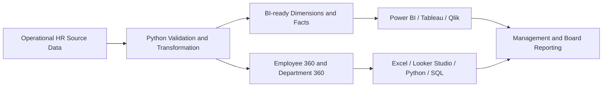

<p align="center">
  
</p>

<h1 align="center">Mokhles Group HR Analytics Demo 2025</h1>

<p align="center">
  <strong>A portfolio-grade, fully synthetic HR and People Analytics ecosystem built for Bangladesh.</strong><br>
  Clean source data, reproducible Python workflows and decision-ready assets for Excel, Power BI, SQL and modern BI platforms.
</p>

<p align="center">
  <a href="https://www.kaggle.com/datasets/samusahr/mokhles-group-hr-analytics-portfolio-bd-fy2025"></a>
  
  
  
  
</p>

<p align="center">
  
  
  
  
  <a href="docs/DATASET_USAGE_GUIDE.md"></a>
</p>

<p align="center">
  <a href="#-overview">Overview</a> ·
  <a href="#-project-snapshot">Snapshot</a> ·
  <a href="#-dataset-usage">Usage</a> ·
  <a href="#-advanced-case-challenge">Case Challenge</a> ·
  <a href="participant_submissions/README.md">Submissions</a> ·
  <a href="#-repository-structure">Structure</a> ·
  <a href="#-quick-start">Quick Start</a>
</p>

---

## ✨ Overview

**Mokhles Group HR Analytics Demo 2025** is an end-to-end analytics project for a fictional Bangladesh-based organisation. It demonstrates the workflow from operational HR records to data validation, analytical modeling, KPI calculation and executive reporting.

> **Analytics flow:** source data → validation → transformation → BI model → KPI calculation → dashboard and management insight.

| Capability | Included |
|---|---|
| 🏢 **Business realism** | Bangladesh names, locations, BDT compensation values and practical HR terminology |
| 📊 **Analytics coverage** | Workforce, recruitment, turnover, leave, diversity, learning, compensation, performance and safety |
| 🧱 **BI engineering** | Dimensions, fact tables, relationships, Power Query, DAX, theme and dashboard blueprint |
| ✅ **Data quality** | Table profiling, field profiling, duplicate checks and validation rules |
| 🐍 **Reproducibility** | Python scripts, structured metadata and Jupyter analysis |
| 🧠 **Advanced case challenge** | A controlled Dhaka–Rajshahi expansion diagnosis with strict evidence rules |
| 🛡️ **Ethical design** | No real employee, payroll, applicant or confidential organisational information |

---

## 📊 Project snapshot

<table>
<tr>
<td width="25%" align="center"><strong>516</strong><br>Employees represented</td>
<td width="25%" align="center"><strong>456</strong><br>Year-end headcount</td>
<td width="25%" align="center"><strong>15</strong><br>BI-ready tables</td>
<td width="25%" align="center"><strong>803</strong><br>Documented fields</td>
</tr>
</table>

| Activity | Volume |
|---|---:|
| Hires | 96 |
| Employee separations | 60 |
| Leave transactions | 1,043 |
| Training participation records | 1,011 |
| Recruitment requisitions | 110 |
| Performance evaluations | 456 |
| Health and safety records | 120 |

---

## 🎯 Dataset usage

Use this dataset to **calculate HR KPIs**, practise **data cleaning**, build **Excel or Power BI dashboards**, write **SQL queries**, perform **Python analysis**, test **workforce-planning scenarios** and create **portfolio or classroom projects**.

| Why use it? | How to use it? | Where can it be used? |
|---|---|---|
| Learn realistic HR analytics without exposing real data | Select the correct table, validate the data, calculate KPIs and build a decision-focused report | Excel, Power BI, Python, SQL, Looker Studio, Tableau, Qlik, Metabase, Kaggle and GitHub |

**Common calculations:** headcount, growth, hiring rate, turnover, retention, time-to-fill, cost per hire, leave utilisation, training ROI, compa-ratio, payroll, performance and safety indicators.

<p align="center">
  <a href="docs/DATASET_USAGE_GUIDE.md"><strong>📘 Get details: Why, how and where to use this dataset →</strong></a>
</p>

<p align="center">
  The detailed guide includes formulas, worked examples, recommended tables, Excel guidance, DAX, Python, SQL, dashboard ideas and responsible-use notes.
</p>

---

## 🧩 Advanced case challenge

### Mokhles Group Rajshahi Expansion Crisis

Mokhles Group copied its mature Dhaka HR operating model into a new Rajshahi office. By Q4 FY2025, hiring, turnover, training, performance, leave and safety indicators were sending conflicting signals. Participants must determine whether Rajshahi is a failing location or whether the organisation is using the wrong workforce operating model for a new location.

| Case requirement | Standard |
|---|---|
| Difficulty | Approximately 80% |
| Data boundary | Existing project data only |
| External data | Prohibited |
| Final decision | Continue, Pause or Redesign |
| Priority actions | Exactly three |
| Evidence rule | Confirmed finding, supported inference, unproven hypothesis or unsupported claim |

<p align="center">
  <a href="docs/case_studies/RAJSHAHI_EXPANSION_CRISIS.md"><strong>🧠 Open the full hardened case →</strong></a>
  &nbsp;·&nbsp;
  <a href="participant_submissions/README.md"><strong>📥 Participant submission guide →</strong></a>
</p>

> Participant solutions must target the dedicated `submissions` branch. Pull requests changing `participant_submissions/**` must not target `main`.

---

## 🧭 Choose your workspace

| Workspace | Best for | Start here |
|---|---|---|
| 🧑‍💻 **GitHub engineering source** | Development, validation and project extension | `data/`, `scripts/`, `notebooks/`, `docs/`, `bi_assets/` |
| 🌐 **Kaggle distribution workspace** | Clean numbered folders and download-friendly learning | `packages/kaggle/structured_workspace/` |
| 📊 **Quick employee analysis** | One-row-per-employee exploration | `data/analysis_ready/employee_360_fy2025.csv` |
| 🏢 **Department comparison** | Executive and department-level analysis | `data/analysis_ready/department_360_summary_fy2025.csv` |
| 🧱 **Relational BI model** | Power BI, Tableau and Qlik modeling | `data/bi_ready_csv/` |
| 🧠 **Advanced case study** | Dhaka–Rajshahi expansion diagnosis | `docs/case_studies/` |
| 📥 **Participant solutions** | Isolated challenge submissions | `participant_submissions/` on branch `submissions` |

---

## 🧱 Analytics architecture



| Layer | Purpose | Location |
|---|---|---|
| **Source data** | Authoritative operational-style tables | `data/csv/`, `data/excel/` |
| **BI-ready layer** | Normalised dimensions and facts | `data/bi_ready_csv/` |
| **Analysis-ready layer** | Consolidated Employee 360 and Department 360 | `data/analysis_ready/` |
| **Data quality** | Profiles and validation rules | `data/data_quality/` |
| **BI assets** | Relationships, KPIs, DAX, theme and blueprints | `bi_assets/`, `docs/platforms/` |
| **Case studies** | Advanced decision cases and evaluation standards | `docs/case_studies/` |
| **Participant submissions** | Isolated solution workspace | `participant_submissions/` |
| **Kaggle package** | Structured download and learning workspace | `packages/kaggle/` |

---

## 🗂️ Repository structure

```text
mokhles-hr-analytics/
├── .github/                    # Workflows, policies and contribution templates
├── assets/                     # Repository visuals
├── bi_assets/                  # Power BI theme and semantic-model assets
├── data/
│   ├── csv/                    # Original analytical CSV tables
│   ├── excel/                  # Master and specialist workbooks
│   ├── bi_ready_csv/           # Dimensions and fact tables
│   ├── analysis_ready/         # Employee 360 and Department 360
│   └── data_quality/           # Profiles and validation rules
├── docs/
│   ├── DATASET_USAGE_GUIDE.md  # Why, how, where and KPI calculations
│   ├── case_studies/            # Hardened business cases
│   ├── governance/              # Main-branch and submission policy
│   ├── bi/
│   └── platforms/
├── notebooks/                  # Jupyter analysis
├── packages/
│   └── kaggle/
│       ├── structured_workspace/
│       └── publish/
├── participant_submissions/    # Participant solutions; target submissions branch
├── scripts/                    # Build, profile and validation scripts
├── src/                        # Reusable Python package
├── tests/                      # Runtime compatibility tests
├── wiki/                       # Repository-maintained Wiki source
├── CITATION.cff
├── LICENSE
├── LICENSE-CODE
├── README.md
└── requirements.txt
```

---

## 🚀 Quick start

### 1. Clone and prepare

```bash
git clone https://github.com/samusa099/mokhles-hr-analytics.git
cd mokhles-hr-analytics
python -m venv .venv
```

**Windows PowerShell**

```powershell
.\.venv\Scripts\Activate.ps1
py -m pip install -r requirements.txt
py -m pip install -e .
```

**macOS or Linux**

```bash
source .venv/bin/activate
python -m pip install -r requirements.txt
python -m pip install -e .
```

### 2. Validate and build

```bash
python -m unittest discover -s tests -v
python scripts/validate_repository.py
python scripts/build_bi_ready_layer.py
python scripts/build_analysis_ready.py
python scripts/profile_data.py
```

### 3. Explore

```bash
jupyter lab notebooks/Mokhles_HR_Analytics_EDA.ipynb
```

---

## 📚 Documentation map

- 🧠 **[Rajshahi Expansion Crisis — Advanced Case Study](docs/case_studies/RAJSHAHI_EXPANSION_CRISIS.md)**
- 📥 **[Participant Submission Guide](participant_submissions/README.md)**
- 🧾 **[Participant Submission Template](participant_submissions/SUBMISSION_TEMPLATE.md)**
- 🛡️ **[Main Branch Protection and Submission Governance](docs/governance/MAIN_BRANCH_PROTECTION.md)**
- 🚀 **[v2.4.0 Release Notes — Runtime Compatibility & Deployment Readiness](RELEASE_NOTES_v2.4.0.md)**
- 📘 **[Detailed Dataset Usage Guide — Why, How, Where and Calculations](docs/DATASET_USAGE_GUIDE.md)**
- 🟨 [Power BI implementation](docs/platforms/power_bi_assets/)
- 🟩 [Excel analytics](docs/platforms/excel_analytics/)
- 🟦 [Looker Studio](docs/platforms/looker_studio/)
- 🟪 [Tableau, Qlik and Metabase](docs/platforms/)
- 📦 [Kaggle workspace guide](packages/kaggle/README.md)
- 📖 [Project Wiki source](wiki/Home.md)

---

## 👤 Author

**Musa**  
Human Resources Professional and People Analytics Practitioner, Bangladesh.

---

## ⚖️ Licences

- **Dataset and documentation:** CC BY 4.0 — see `LICENSE`
- **Python code and notebook utilities:** MIT — see `LICENSE-CODE`

---

## 🛡️ Data ethics

Mokhles Group is fictional. All employee, applicant, compensation, performance, leave, training and workplace-safety records are synthetic. They must not be presented as real organisational or employee information.
