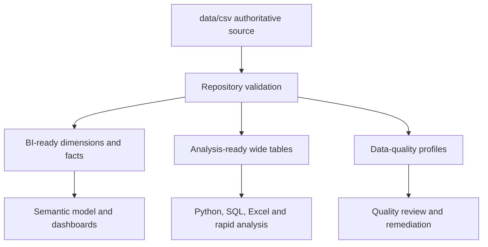

# Data Architecture

## End-to-end flow

## Repository layers

| Layer | Location | Purpose |
|---|---|---|
| Source | `data/csv/` | Authoritative operational-style HR tables |
| Excel | `data/excel/` | Master and specialist workbooks |
| BI-ready | `data/bi_ready_csv/` | Normalized dimensions and fact tables |
| Analysis-ready | `data/analysis_ready/` | Employee 360 and Department 360 outputs |
| Quality | `data/data_quality/` | Profiles, duplicate checks and validation rules |
| Semantic assets | `bi_assets/` | Relationships, DAX, theme and dashboard blueprint |
| Automation | `scripts/` and `src/` | Reproducible validation and transformation logic |
| Exploration | `notebooks/` | Jupyter-based EDA and examples |
| Distribution | `packages/kaggle/` | Numbered, download-friendly learning package |

## Dimensional model

The BI-ready layer contains 15 tables:

### Dimensions

- `00_dim_date.csv`
- `00_dim_department.csv`
- `00_dim_location.csv`
- `01_dim_employee_fy2025.csv`
- `08_dim_diversity_inclusion_fy2025.csv`

### Facts and summaries

- `02_fact_monthly_hr_kpi_fy2025.csv`
- `03_fact_department_annual_summary_fy2025.csv`
- `04_fact_quarterly_board_kpi_fy2025.csv`
- `05_fact_recruitment_fy2025.csv`
- `06_fact_employee_separations_fy2025.csv`
- `07_fact_leave_transactions_fy2025.csv`
- `09_fact_training_development_fy2025.csv`
- `10_fact_compensation_benefits_fy2025.csv`
- `11_fact_performance_evaluation_fy2025.csv`
- `12_fact_health_safety_fy2025.csv`

## Relationship principles

- Use one-to-many dimension-to-fact relationships.
- Prefer single-direction filtering.
- Keep one active date relationship per fact table.
- Mark `00_dim_date[date]` as the date table in Power BI.
- Use keys such as `employee_id`, department, location and date consistently.
- Validate grain before joining transaction tables to employee-level tables.

## Grain reference

| Grain | Meaning | Examples |
|---|---|---|
| Employee | One row per employee | Employee 360, employee dimension |
| Transaction | One row per event | Leave, training, recruitment, safety |
| Department-month | One department for one month | Monthly HR KPI |
| Department-year | One department for FY2025 | Department annual summary |
| Quarter | One reporting quarter or board KPI | Quarterly board KPI |

## Generated-file policy

Generated files should be rebuilt through scripts instead of edited manually. This preserves lineage, repeatability and consistency between GitHub, Kaggle and BI outputs.
