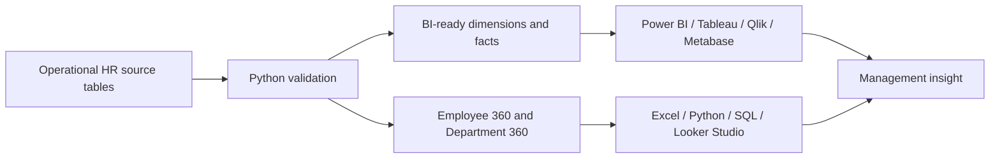

# Mokhles Group HR Analytics — Project Wiki

Welcome to the complete documentation hub for **Mokhles Group HR Analytics Demo 2025** — a portfolio-grade, fully synthetic HR and People Analytics ecosystem designed for Bangladesh.

> **Data ethics:** Mokhles Group is fictional. Every employee, applicant, payroll, performance, leave, training and safety record is synthetic.

## Project at a glance

| Measure | Value |
|---|---:|
| Employees represented | 516 |
| FY2025 year-end headcount | 456 |
| Hires | 96 |
| Separations | 60 |
| Leave transactions | 1,043 |
| Training participation records | 1,011 |
| Recruitment requisitions | 110 |
| Performance evaluations | 456 |
| Health and safety records | 120 |
| BI-ready tables | 15 |
| Documented fields | 803 |

## What this project demonstrates

- Operational HR data design and validation
- Reproducible Python transformation workflows
- Star-schema and semantic-model preparation
- Employee 360 and Department 360 analytical layers
- HR KPI calculation and validation
- Excel, Power BI, SQL, Python and modern BI usage
- Executive dashboard and management-report design
- Advanced case analysis with evidence classification
- Safe portfolio development using synthetic information

## Analytics architecture



## Start here

| Goal | Wiki page |
|---|---|
| Install and run the project | [Getting Started](Getting-Started) |
| Understand folders and data flow | [Data Architecture](Data-Architecture) |
| Select the right table | [Dataset Catalog](Dataset-Catalog) |
| Calculate HR metrics | [KPI Library](KPI-Library) |
| Follow an analytical workflow | [Analytics Workflows](Analytics-Workflows) |
| Build dashboards | [BI and Platform Guides](BI-and-Platform-Guides) |
| Complete the expansion challenge | [Rajshahi Expansion Case](Rajshahi-Expansion-Case) |
| Understand controls and policies | [Governance and Data Ethics](Governance-and-Data-Ethics) |
| Submit improvements | [Contributing](Contributing) |
| Review versions and direction | [Releases and Roadmap](Releases-and-Roadmap) |

## Recommended first workflow

```bash
python -m venv .venv
python -m pip install -r requirements.txt
python -m pip install -e .
python -m unittest discover -s tests -v
python scripts/validate_repository.py
python scripts/build_bi_ready_layer.py
python scripts/build_analysis_ready.py
python scripts/profile_data.py
```

Then open:

```bash
jupyter lab notebooks/Mokhles_HR_Analytics_EDA.ipynb
```

## Main project links

- [Repository](https://github.com/samusa099/mokhles-hr-analytics)
- [Kaggle dataset](https://www.kaggle.com/datasets/samusahr/mokhles-group-hr-analytics-portfolio-bd-fy2025)
- [Dataset usage guide](../docs/DATASET_USAGE_GUIDE.md)
- [Participant submissions](../participant_submissions/README.md)
- [Main branch governance](../docs/governance/MAIN_BRANCH_PROTECTION.md)

## Author

**Siam Ahmad Musa**  
HR Professional and People Analytics Practitioner, Bangladesh
